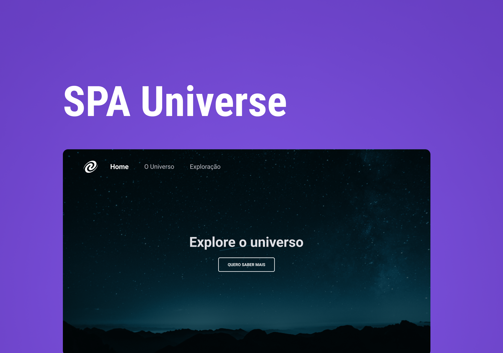

# SPA UNIVERSE

Criação de SPA como desafio proposto pelo programa explorer da Rocketseat, aonde pude colocar em prática o que venho aprendendo em JavaScript. Além de aprender princípios básicos de POO, e criar um servidor com NODE JS para rodar a SPA.

## Tecnologias utilizas:

- HTML5;
- CSS3;
- JAVASCRIPT;
- NODE JS (Para rodar a SPA;
